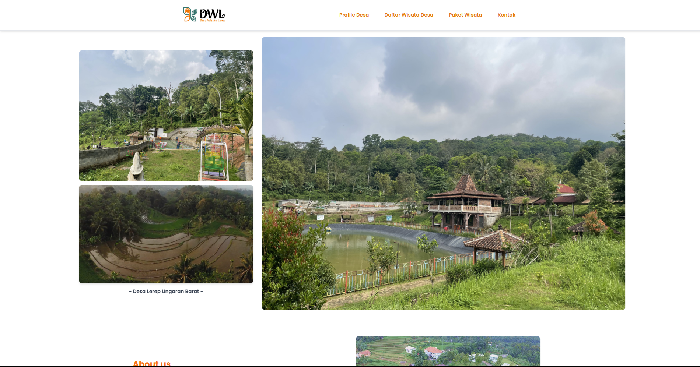
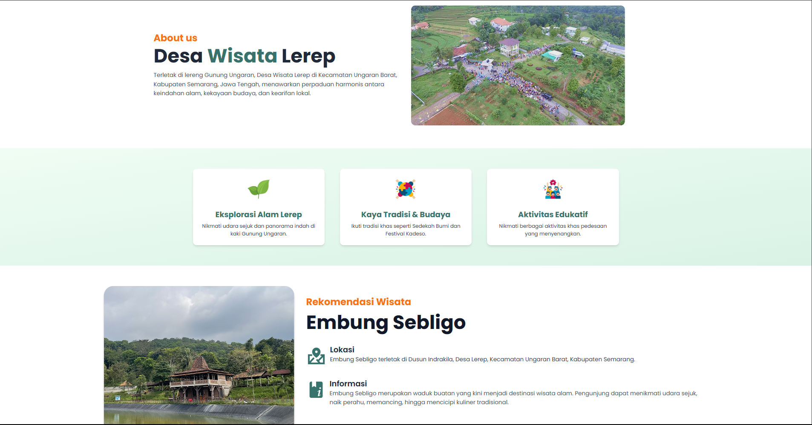
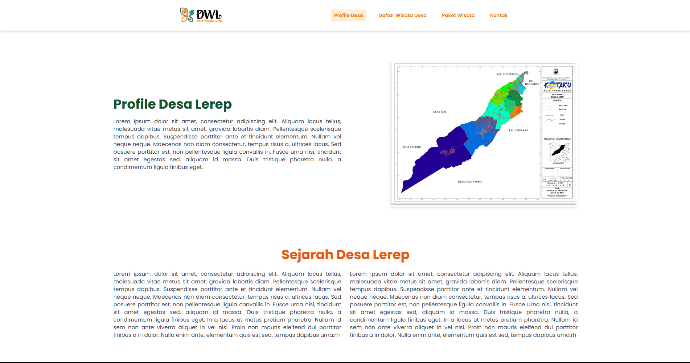
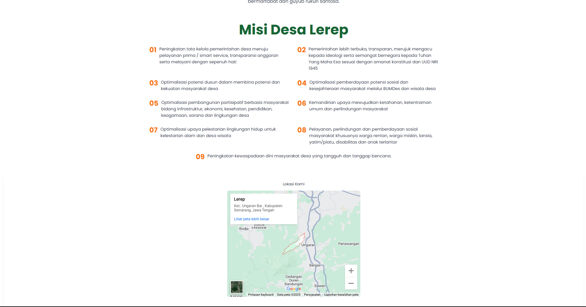
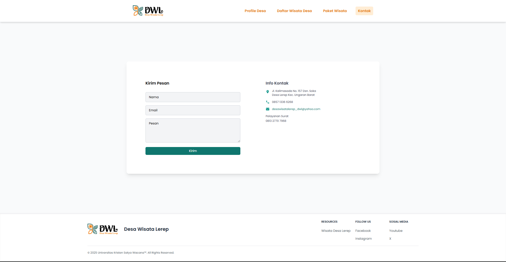

<p align="center">
    <a href="https://laravel.com" target="_blank">
        
    </a>
</p>

<p align="center">
    <a href="https://packagist.org/packages/laravel/framework">
        
    </a>
    <a href="https://packagist.org/packages/laravel/framework">
        
    </a>
    <a href="https://packagist.org/packages/laravel/framework">
        
    </a>
</p>

# 🌄✨ Website Wisata Desa ✨🌄

**Website Wisata Desa** adalah aplikasi berbasis **Laravel** yang dikembangkan untuk mempromosikan potensi wisata di sebuah desa. Website ini memiliki fitur:

-   Informasi lengkap destinasi wisata desa
-   Galeri foto wisata
-   Halaman tentang desa
-   Informasi kontak dan lokasi desa wisata
-   (Opsional) Admin dashboard untuk CRUD data wisata

## 🚀 Fitur Utama

-   ✅ Beranda dengan deskripsi wisata desa
-   ✅ Tentang desa (profil dan sejarah)
-   ✅ Galeri foto wisata
-   ✅ Kontak dan lokasi desa wisata
-   ✅ Login Admin & Manajemen Data Wisata

## 📷 Screenshot

<p align="center">
    
    <br>
    
    <br>
    
    <br>
    
    <br>
    
    <br>
    
    <br>
    
    <br>
</p>

## ⚙️ Instalasi

### 🔗 Clone repository

```
git clone https://github.com/billalcahya/websitewisatadesa.git
cd websitewisatadesa
```

## 📦 Install dependencies

Pastikan Composer sudah terinstall. Jalankan:

```
composer install
npm install
npm run dev
```

## ⚙️ Konfigurasi environment

Copy file .env.example menjadi .env:

```
cp .env.example .env
```

Generate application key:

```
php artisan key:generate
```

## 🛢️ Setup database

Buat database di phpMyAdmin sesuai nama di .env

Sesuaikan konfigurasi database:

```
DB_CONNECTION=mysql
DB_HOST=127.0.0.1
DB_PORT=3306
DB_DATABASE=nama_database
DB_USERNAME=root
DB_PASSWORD=
```

Jalankan migration :

```
php artisan migrate
php artisan db:seed
```

## 🚀 Jalankan server

```
php artisan serve
```

Buka browser dan akses: http://127.0.0.1:8000

## 📝 Struktur Folder Penting

```
websitewisatadesa/
├── app/
├── bootstrap/
├── config/
├── database/
│   ├── migrations/
│   └── seeders/
├── public/
├── resources/
│   └── views/
├── routes/
│   └── web.php
├── .env
└── composer.json
```

## 🛠️ Built With

-   🌐 Laravel

-   🎨 Bootstrap / Tailwind

-   🗃️ MySQL

-   📝 Blade

## 💡 Catatan

-   Pastikan composer install berhasil sebelum menjalankan server.

-   Jika menggunakan XAMPP/Laragon, letakkan folder di htdocs.

-   Sesuaikan nama database di .env dengan phpMyAdmin.

-   Jika menggunakan asset frontend (CSS/JS) dengan Vite, jalankan juga npm run dev atau npm run build sesuai kebutuhan.
